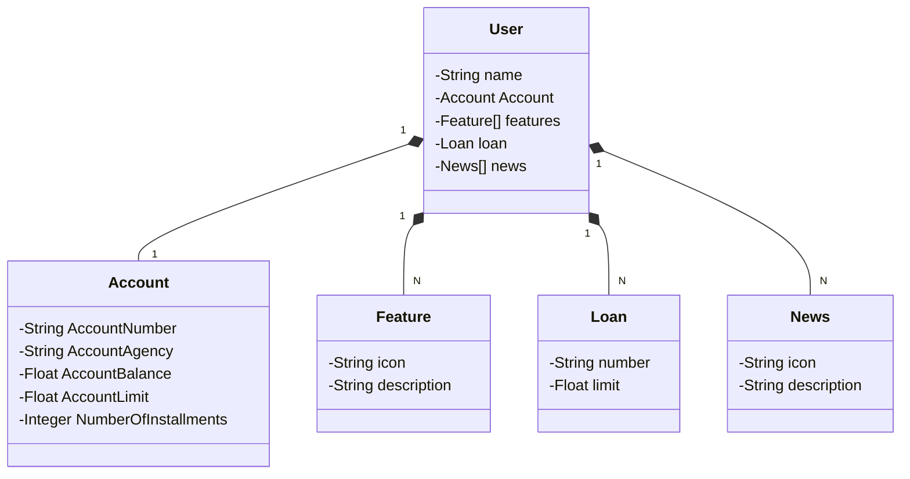

  
 

  <H1><b>Election Control System - SORRAB </b> </H1>

  
 System created for Java AI Powered DIO.
 

  🦄 <b>Main Technologies</b> 

<ul>
<li>

**Java 17**: We will use the latest LTS version of Java to take advantage of the latest innovations that this robust and widely used language offers;
</li>
<li>

**Quarkus**: A **Java framework** native to **Kubernetes**, optimized for **container**, **cloud**, and **serverless** environments. Developed by **Red Hat**, Quarkus combines **imperative** and **reactive** code paradigms. It specifically tailors Java for containers, making it an effective platform for serverless, cloud, and Kubernetes environments. 🚀
</li>
<li>

**Spring Boot 3**: We will work with the newest version of Spring Boot, which maximizes developer productivity through its powerful self-configuration premise;
</li>
<li>

**Spring Data JPA**: We will explore how this tool can simplify our data access layer, facilitating integration with SQL databases;
</li>
<li>

**OpenAPI (Swagger)**: We will create effective and easy-to-understand API documentation using OpenAPI (Swagger), perfectly aligned with the high productivity that Spring Boot offers;
</li>
<li>

**Railway**: facilitates the deployment and monitoring of our solutions in the cloud, in addition to offering several databases as a service and CI/CD pipelines.
</li>
</ul>

<b>Class Diagram</b> 

  💌 For more information contact us: ⤵️

  

  

  

  
  

Please follow github and join us!
Thanks for visiting and happy coding!

